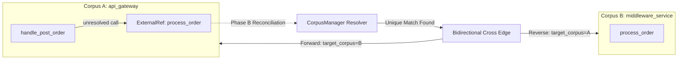

# How Cross-Corpus Graph Federation Works

In modern multi-service and micro-frontend architectures, codebases rarely live in a single repository. A complete user flow often spans an API gateway, downstream microservices, database access layers, and infrastructure deployment definitions.

`ctxvault` provides **cross-corpus graph federation** and **multi-repo symbol resolution** without sacrificing single-repo index isolation or requiring centralized monolithic databases.

See also: [[RFC-cross-corpus-graph-federation]], [[ARCHITECTURE]], [[how-architecture-detection-works]].

---

## 1. Architectural Invariants

Federation adheres strictly to `ctxvault`'s core principles:

1. **Source on Disk is Authoritative**: All derived indices (Tantivy BM25, HNSW vectors, SQLite metadata, Petgraph graph) are rebuildable.
2. **Single-Repo Isolation (I2)**: Repositories are indexed completely independently. Single-repo indexing emits intra-repo edges without knowledge of other corpora.
3. **Bounded Latency (I3)**: Cross-corpus hops and traversals are strictly bounded by per-corpus depth limits and global hop budgets.
4. **Pure Rust Safety (I4)**: Implemented in 100% pure Rust (`#![forbid(unsafe_code)]`) with zero external daemon or runtime C dependencies.
5. **Language-Agnostic & Cross-Modal (I6)**: Unifies polyglot codebases (Rust, TypeScript, Go, Python, Java, HCL, etc.) and markdown documentation in a single federated model.

---

## 2. Two-Phase Symbol Resolution



### Phase A: Deferred External Reference Capture
During single-corpus indexing, AST visitors extract definitions, imports, and calls. When a call or import cannot be resolved locally within the repository:
- The local intra-repo graph remains clean.
- The unresolved target is captured as an `ExternalRef` row in the corpus's SQLite catalog (`caller_scope_path`, `raw_target`, `kind`, `confidence`).

### Phase B: Reconciliation & Trust Ladder
At daemon startup or upon corpus sync, `CorpusManager::resolve_external_refs()` reconciles external references across mounted corpora using a tiered trust ladder:
1. **SCIP Monikers**: High-precision semantic monikers when indexers are available.
2. **Qualified-Name Resolution**: Unambiguous symbol matches across corpora (`crates`, packages, modules).
3. **Ambiguity Gate**: Exactly one candidate must match across external corpora. Zero or multiple matches produce no edge, preventing false links.

When a unique match is found, rich bidirectional edges are emitted:
- **Forward Edge** in source corpus: `caller -> "<target_corpus>::<target_symbol>"` with `target_corpus`, `target_path`, `target_symbol`, and `target_kind`.
- **Reverse Mirror Edge** in target corpus: `target_symbol -> "<source_corpus>::<caller>"` enabling return-path exploration.

---

## 3. Infrastructure & Boundary Resources

Federation treats infrastructure as code (IaC) as first-class graph participants:
- Terraform (`.tf`) resources (`resource "aws_s3_bucket" "orders_data"`) are extracted via Tree-sitter HCL into symbols with `target_kind: "Resource"`.
- Bicep and Kubernetes declarations are mapped to resource boundary nodes.
- Downstream services referencing database tables, buckets, or message queues automatically link across corpora to the infrastructure repository defining them.

---

## 4. Federated Traversal (`trace_cross_corpus`)

Unlike systems that merely annotate edge properties and require manual follow-up queries, `ctxvault` supports **live cross-corpus BFS continuation**:

```rust
// Traverse from api_gateway through middleware into database and infra
let trace = manager.federated_traverse(
    "api_gateway",          // start corpus
    "handle_post_order",    // start node
    4,                      // per-corpus depth limit
    5,                      // max cross-corpus hop budget
    true,                   // continue_across live into target corpora
)?;
```

### Traversal Semantics
- **Cycle Guard**: Visited state is tracked per `(corpus, node)` pair, preventing infinite loops across cyclic service dependencies.
- **Hop Reporting**: Every boundary crossed emits a structured `CorpusHop`:
  ```json
  {
    "from_corpus": "api_gateway",
    "from_node": "handle_post_order",
    "to_corpus": "middleware_service",
    "to_node": "process_order",
    "edge_type": "calls",
    "target_kind": "Symbol",
    "corpus_depth": 1
  }
  ```
- **Bidirectional Return Tracing**: Because reverse mirror edges are materialized during Phase B, any federated path can be explored backwards (e.g. from an S3 bucket in `infra` back to the gateway handler that writes to it).

---

## 5. Index Bundle Export & Import

Corpora can be distributed and shared across teams or CI/CD pipelines without re-indexing source trees:

- **`export_corpus`**: Compresses `.index/` (`graph.bin`, `meta.db`, `vectors.bin`, `tantivy/`) into a `.tar.zst` archive with a signed `manifest.json`.
- **Compatibility Validation**:
  - Embedding model name and dimension verification.
  - Graph schema version check (`GRAPH_SCHEMA_VERSION = 2`).
  - Safe extraction preventing directory traversal attacks (`Path::is_relative`, normalized path components).
- **CLI Subcommands**:
  ```bash
  ctxvault export-artifact --corpus my-service --output my-service.index.tar.zst
  ctxvault import-artifact --archive my-service.index.tar.zst --data-dir .
  ```
