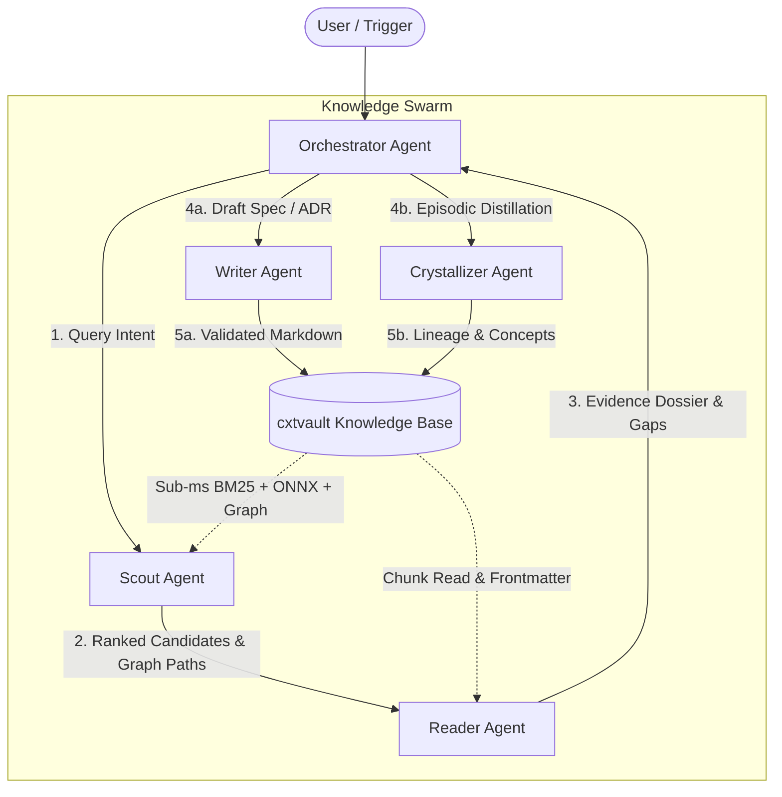

# Multi-Agent Swarm Orchestration with cxtvault

This guide provides blueprint architectures for orchestrating multi-agent swarms powered by `cxtvault` as a sub-millisecond, shared semantic memory substrate.



---

## 1. Pipeline Blueprints

### Pipeline A: Autonomous Technical Research Swarm
*Goal: Answer deep multi-faceted engineering questions with rigorous citations and verified facts.*

1. **Orchestrator** receives user query (e.g. *"How do we handle SQLite lock contention during parallel vector compaction?"*).
2. **Scout Agent** executes `search_hybrid`, `search_graph`, and `graph_path` between SQLite storage and vector compaction nodes. Returns top 4 candidate paths and snippets.
3. **Reader Agent** reads candidate documents (`read_note`), validates that documents are currently `accepted` (not `superseded`), checks for semantic gaps with `find_semantic_gaps`, and compiles an Evidence Dossier.
4. **Orchestrator** delivers a comprehensive, cited response to the user.

---

### Pipeline B: Incident-to-ADR Knowledge Crystallization Swarm
*Goal: Convert raw incident debugging traces into permanent Architecture Decision Records with full provenance.*

1. **Incident Trigger**: Agent finishes resolving an outage or complex bug recorded in a scratchpad/incident log.
2. **Crystallizer Agent** inspects the conversation log and calls `promote_concept` targeting `concepts/` or `decisions/`.
3. **Writer Agent** fills in required ADR sections (`Context`, `Decision`, `Consequences`), formats frontmatter according to `decision_record` template, and calls `validate_note`.
4. **Crystallizer Agent** runs `traverse_lineage` to ensure the new ADR links back to the original incident note.

---

### Pipeline C: Continuous Vault Hygiene & Refactoring Swarm
*Goal: Maintain clean taxonomy, fix broken links, split bloated notes, and optimize graph topology.*

1. **Ops / Scout Agent** executes `validate_corpus`, `coverage_report`, and `graph_communities`.
2. **Crystallizer Agent** calls `suggest_splits` on high-token nodes identified as monolithic clusters.
3. **Writer Agent** moves or refactors notes using `create_note`, `update_note`, `move_note`, and immediately runs `validate_note` and `validate_taxonomy`.
4. **Ops Agent** calls `sync_corpus` to update the active search index.

---

## 2. Handoff Message Contracts

### Scout to Reader Handoff Contract
```json
{
  "handoff_type": "SCOUT_TO_READER",
  "query": "SQLite lock contention during compaction",
  "candidates": [
    {
      "path": "decisions/adr-001-graph-engine.md",
      "score": 0.045,
      "summary_snippet": "SQLite WAL mode with busy_timeout configured for 5000ms."
    },
    {
      "path": "concepts/vector-index.md",
      "score": 0.038,
      "summary_snippet": "Compaction runs in background thread acquiring temporary write transaction."
    }
  ],
  "graph_connections": [
    { "from": "decisions/adr-001-graph-engine.md", "to": "concepts/vector-index.md", "type": "Implements" }
  ]
}
```

### Reader to Writer Handoff Contract
```json
{
  "handoff_type": "READER_TO_WRITER",
  "task": "DRAFT_ADR",
  "template": "decision_record",
  "target_path": "decisions/adr-004-wal-compaction-locks.md",
  "frontmatter": {
    "title": "ADR 004: Dedicated WAL Connection Pool for Vector Compaction",
    "status": "proposed",
    "date": "2026-08-30",
    "tags": ["sqlite", "concurrency", "vector"]
  },
  "sections": {
    "Context": "Vector compaction holding SQLite write locks causes stdio RPC latency spikes.",
    "Decision": "Isolate vector metadata to a secondary SQLite connection with WAL PRAGMAs.",
    "Consequences": "Zero reader thread blocking, slight increase in memory footprint."
  }
}
```
